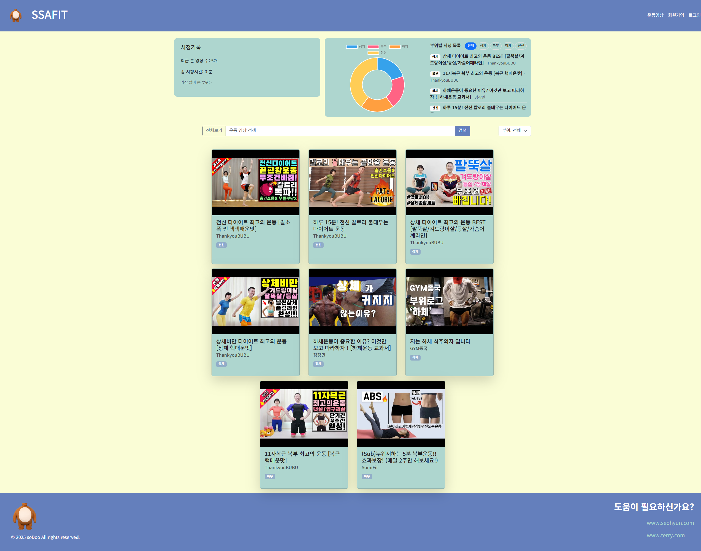

# SSAFIT Web(Front) Project

## 📌 개요
**SSAFIT**은 YouTube 운동 영상 데이터를 기반으로 영상 검색, 추천, 리뷰, 회원 관리 기능을 제공하는 웹 프론트엔드 애플리케이션입니다.  
HTML, CSS, JavaScript, Bootstrap을 활용하여 반응형 UI와 동적 기능을 구현합니다.

---
## 👥 프로젝트 규모 · 인원
- 기간: 2025-09-05 - 2025-09-06 (2day)  
- 인원: 2명
  - 안태리 — 영상/리뷰/메인. 프로젝트 구조 설계
  - 이서현 - 로그인/회원가입/header/footer. 디자인

---

## 🎯 프로젝트 목표
- HTML5, CSS3, JavaScript 문법 및 DOM 조작 학습
- Bootstrap 기반 반응형 UI 설계
- 로컬 스토리지 CRUD 기능 구현 (리뷰, 로그인 기능, 영상데이터)
- UX/UI 설계 및 접근성 고려

---

## 🛠 기술 스택
- **언어**: HTML, CSS, JavaScript  
- **라이브러리/프레임워크**: Bootstrap 5, Chart.js (옵션)  
- **데이터**: JSON (YouTube 영상 데이터 샘플)  
- **개발 환경**: VS Code, GitLab  

---

## 📂 디렉토리 구조
```
📦ssafit
 ┣ 📂frontend
 ┃ ┣ 📂assets                  // 데이터, 이미지 저장소
 ┃ ┃ ┣ 📂data
 ┃ ┃ ┃ ┗ 📜video.json            // 유튜브 영상 데이터
 ┃ ┃ ┗ 📂img
 ┃ ┃ ┃ ┣ 📜google-icon.svg
 ┃ ┃ ┃ ┣ 📜kakaotalk-icon.svg
 ┃ ┃ ┃ ┣ 📜naver-icon.svg
 ┃ ┃ ┃ ┗ 📜소두곰_배경제거.png
 ┃ ┣ 📂css                     // 커스텀 css
 ┃ ┃ ┣ 📜color.css               // 공통 색상 지정 css
 ┃ ┃ ┣ 📜font.css
 ┃ ┃ ┣ 📜login.css
 ┃ ┃ ┣ 📜profile.css
 ┃ ┃ ┣ 📜signup.css
 ┃ ┃ ┗ 📜style.css               // 공통 css
 ┃ ┣ 📂js                      // 커스텀 js
 ┃ ┃ ┣ 📜dashboard.js            // 차트 그리는 js
 ┃ ┃ ┣ 📜layout.js               // header footer 로드해서 붙이는 js
 ┃ ┃ ┣ 📜login.js                // 로그인
 ┃ ┃ ┣ 📜profile.js              // 회원정보 관련
 ┃ ┃ ┣ 📜signup.js               // 회원가입 관련
 ┃ ┃ ┣ 📜video-view.js           // 비디오 시청 페이지용 js. 리뷰 관리 기능 이 있음. 시청기록 관리 기능
 ┃ ┃ ┗ 📜video.js                // 비디오 목록들을 불러오고 검색 및 필터링 기능. 비디오들 렌더링.
 ┃ ┣ 📂pages                   // html 페이지들 관리 디렉토리
 ┃ ┃ ┣ 📂videos                  // 비디오 관련 페이지들
 ┃ ┃ ┃ ┣ 📜video-main.html          // 비디오 목록들 검색 및 필터링 페이지
 ┃ ┃ ┃ ┗ 📜video-view.html          // 비디오 시청 페이지
 ┃ ┃ ┣ 📜login.html
 ┃ ┃ ┣ 📜profile.html
 ┃ ┃ ┗ 📜signup.html
 ┃ ┣ 📂partials               // 여러곳에서 재사용 되는 html 모듈화
 ┃ ┃ ┣ 📜footer.html
 ┃ ┃ ┣ 📜header.html
 ┃ ┃ ┗ 📜videos.html
 ┃ ┗ 📜index.html
 ┗ 📜README.md
```

---

## ⚡ 주요 기능
### 1. 필수 기능
- **영상 정보 관리**: `조회`, ~~`등록`, `수정`, `삭제`~~ *당신은 오롯이 시청만 가능하다*
- **영상 검색 및 정렬**: `검색어, 부위별 필터링 가능.` *정렬도 운동이니 당신이 직접하도록*
- **리뷰 관리**: `등록`, `조회`, `삭제` *한번 작성한 리뷰는 수정이 안되니 신중히 작성*
- **회원 관리**: `가입`, `조회`, `수정`, `로그인` *주의⚠️ 우리의 서비스는 한번가입하면 탈퇴가 불가능함. 한번로그인하면 로그아웃이 안되는 자동로그인 기능? 지원*


---

## 📸 화면
### header `header.html`
<a href="/ssafit/frontend/partials/header.html">`header.html`</a>

`partials/header.html`는 공용. [`layout.js`](ssafit/frontend/js/layout.js)가 #header-container에 주입하도록 만들었음<br>
로그인을 하면 로그인 버튼 대신 회원 이름과 회원정보 페이지로 가는 버튼으로 바뀜


### footer
<a href="/ssafit/frontend/partials/footer.html">`footer.html`</a>

`partials/footer.html`는 공용. [`layout.js`](ssafit/frontend/js/layout.js)가 #footer-container에 주입하도록 만들었음<br>
### 메인 화면 `index.html`

1. **시청 기록 기능** <br>
`영상카드`를 클릭해서 접속하면 `localStorage`에 시청기록이 담긴다.<br>
해당 시청기록을 기반으로 부위별 비율 (%) 를 차트로 그려준다. <br>
*차트 그리는 js* : `dashboard.js`

2. **영상 검색 및 필터링** <br>
   <a href="#운동-영상-화면"> 운동 영상 화면 기능과 동일 </a>


### 회원 가입 / 로그인 화면
.png)

- file: `pages/login.html` `pages/signup.html`, `pages/forfile.html`
- scripts: `login.js`, `signup.js`, `profile.js`
- 기능
   - 가입: 유효성 검사후 사용자 추가 (로컬 스토리지에 저장함. 비밀번호 찾기는는 개발자도구로 언제든지 찾을수 있음!!)
   - 로그인
   - 프로필: 조회/수정
   - 로그인을 하면 로그인 버튼이 닉네임으로 바뀌고 회원정보 페이지 바로가기로 바뀜.


LocalStorage에 회원정보 및 로그인 유저 저장

`ssafit:users` 사용자 배열
`ssafit:user` 현재 로그인 사용자

### 운동 영상 화면


[video-main.html](/ssafit/frontend/pages/videos/video-main.html) <br>
[video.js](/ssafit/frontend/js/video.js)

- 기능
   - 검색: 제목 검색 쿼리 지원 
   - 필터: `part` 셀렉트
   - 영상 카드 렌더링: 카드 클릭시 시청 페이지로 이동
- 라우팅
   - 시청 페이지 : `pages/videos/video-view.html?id=<YouTubeID>`

해당 페이지에 접속하면 DOMload 에 영상데이터(json) 을 가져오도록 이벤트 리스너를 추가함.
검색 및 필터링 기능은 가져온 데이터 기반으로 해당되는 영상 리스트를 만들어 다시 랜더링 하는 형식임.

bootstrap의 grid 를 사용해서 반응형으로 만듬 화면 사이즈에 따라 col 개수 조절


### 영상 시청 화면


[video-view.html](/ssafit/frontend/pages/videos/video-view.html)<br>
[video-view.js](/ssafit/frontend/pages/videos/video-view.html)

- 기능
   - 플레이어 임베드, 제목/채널/부위 표시
   - 리뷰: 등록/조회/삭제 (로컬스토리지)
   - 시청 기록: 해당 페이지 방문시 해당 영상 시청기록으로 남김 (로컬 스토리지)


---

## 🚀 실행 방법
1. 저장소 클론
   ```bash
   git clone https://github.com/ssafy14-seoul13/PJT2-F-SSAFIT
   ```
vscode liveserver 로 index.html 실행
